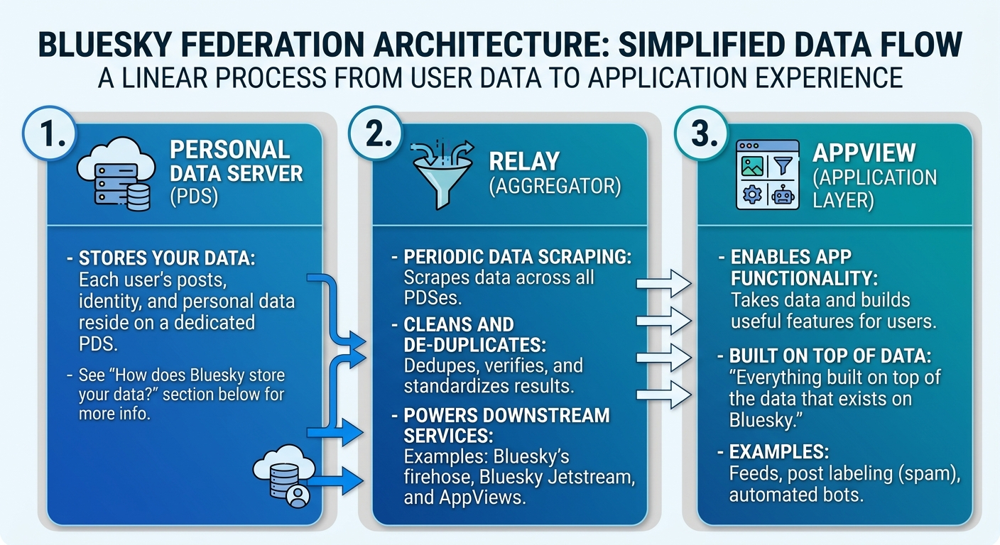

# Bluesky Architecture Deep Dive

## Bluesky architecture

To learn more about Bluesky's architecture, see [this deep dive](https://docs.bsky.app/docs/advanced-guides/federation-architecture) from the Bluesky team. They do a great job of describing it in detail, though it's admittedly a bit engineering-heavy. They also do a deeper dive explanation of [each component individually and how they fit together](https://atproto.com/guides/the-at-stack).

In simpler terms, there's 3 concepts to know:

- **PDS (Personal Data Server)**: these store your data (see the "How does Bluesky store your data?" section below for more info on how this works).
- **Relay**: this is a service that, every so often, scrapes the data across all the PDSes, cleans it up (deduplicates, verifies, etc.) and then makes the results available to anything that's using it. Here's a full writeup of [the Bluesky Relay](https://bsky.network/docs/relay/) design. The main Bluesky relay powers a few downstream services, such as [Bluesky's firehose](https://bsky.network/docs/consuming-the-firehose/), the [Bluesky Jetstream](https://bsky.network/docs/jetstream/), and AppViews (see below).
- **AppView**: An App View is an app layer that takes the data and does all the useful app stuff that powers the usable functionality. For example, an app to generate feeds to show users is an App View. An app to label posts as spam or not spam is an App View. A bot to automatically post on your account is an App View. An App View is a concept that is basically "everything built on top of the data that exists on Bluesky".

Below is a visualization of how this works.



## How does Bluesky store data?

### How does Facebook/Twitter/Google store your data?

When you have an account on Facebook/Twitter/Google, all your data is stored on their proprietary servers. This means that if you wanted to leave the platform and go somewhere else, you can't "download" your data and take it with you. These platforms own your data. They can train their AIs on it, they can block you at will, and they can monetize off your likeness.

### How does Bluesky store your data?

Bluesky designed a system that uses a [PDS (Personal Data Server)](https://github.com/bluesky-social/pds) to store all your data. Basically, a PDS is just a server, same as what Facebook/Twitter/Google would use, but the upside is that anyone can host their own server and plug it into the Bluesky ecosystem. Most people don't want to run their own PDS, so Bluesky has a few servers that they run themselves, but anyone could easily get the data that Bluesky has on them.

The Bluesky team has wider ambitions of building a decentralized social media network, defined by what they call the [AT Protocol](https://atproto.com/guides/overview), of which Bluesky is just the first user-facing product and the PDS is one component in this architecture.

#### How is the data stored?

An individual person's data is stored in something called a [repository](https://atproto.com/guides/data-repos) (aka `repo`). You can imagine this as a "folder". This "folder" has all data about you (all your posts, your likes, who you follow, etc). Each repo/"folder" is stored on a PDS. Whenever you log into the Bluesky app, the app needs to get your data to give you your feed, show you your profile, and get all the data it needs to power your app experience. To do this, it needs to find the PDS that stores your data, pull the "folder" with your info, and get the "files" it needs (e.g., the file with your user info, the file with the list of all your posts, etc.).

At any time you can export the data that Bluesky has on you (including your posts, likes, follows, etc.), see [this guide](https://atproto.com/blog/repo-export) for more steps on that.

### What happens when you get data from Bluesky?

What's actually happening when you get data from Bluesky? Though most of your interactions with Bluesky will be from using the APIs, it's good to get some sense of what's going on under the hood, as this can help with debugging, figuring out what data you can/can't get, and just generally any problems related to getting data from Bluesky.

Additional perk: you can point AI agents to this writeup and they themselves can get up-to-speed. This writeup is (probably, as of the time of writing) the most distilled and digestable writeup of the Bluesky architecture, as most other writeups are designed to be read by software engineers.

#### Example: getting information about a post

A Bluesky post is identified by its [uri](https://atproto.com/specs/at-uri-scheme), which is basically its ID. A uri can look something like this: `at://did:plc:alice123/app.bsky.feed.post/3kxyz`.

Every uri has three key parts:

1. Repo: the "folder" of data.
2. Collection: the "record type". At a high level, this generally means "posts" or "profiles" or "likes". In a literal sense, it's anything that shares the same schema.
3. `rkey`: The record’s key, unique within that repository and collection. This is used for looking up a certain record, for if you need to read or update it. It also is used to reference a record within another record (for example, in a "reply" record, the "reply" record needs to reference the post that it is replying to).

In the example, the parts of the uri are:

- repo = did:plc:alice123
- collection = app.bsky.feed.post
- rkey = 3kxyz

For those familiar with relational databases, a record is unique on the combination of `PRIMARY KEY = (repo_did, collection, rkey)`.

For those familiar with document stores, the equivalent setup is something like this:

```markdown
repository: did:plc:alice
  collection: app.bsky.feed.post
    rkey: 3abc...  -> post document
    rkey: 3def...  -> post document

  collection: app.bsky.feed.like
    rkey: 3ghi...  -> like document
```

When you make an API request to get info about a post, no matter how you do it and in what programming language you do it in, it basically resolves to the following:

```markdown
GET /xrpc/com.atproto.repo.getRecord
  ?repo=did:plc:alice123
  &collection=app.bsky.feed.post
  &rkey=3kxyz
```

When you use the API, the Bluesky relay finds the correct PDS that has the repo you've requested. Each repo is stored in a single PDS. Then, it will give you something that looks like this:

```markdown
{
  "uri": "at://did:plc:alice123/app.bsky.feed.post/3kxyz",
  "cid": "bafy...postCID",
  "value": {
    "$type": "app.bsky.feed.post",
    "text": "Hello",
    "createdAt": "..."
  }
}
```

What's happening under the hood is:

1. Bluesky takes your request and grabs the [DID](https://atproto.com/specs/did). This serves as that account's "username".
2. Bluesky uses that DID to get a DID document. By default, it checks the [PLC directory](https://web.plc.directory/), which maintains a list of each DID and the information about that account. See [here for more details on how PLC works](https://atproto.com/blog/plc-directory-org). DIDs starting with `did:plc` are managed by Bluesky and so Bluesky tracks all info for those users in their own company's PLC directory. What's important for us is that Bluesky looks for a document that looks like the following:

```markdown
{
  "id": "did:plc:alice123",
  "verificationMethod": [
    {
      "id": "did:plc:alice123#atproto",
      "type": "Multikey",
      "publicKeyMultibase": "..."
    }
  ],
  "service": [
    {
      "id": "#atproto_pds",
      "type": "AtprotoPersonalDataServer",
      "serviceEndpoint": "https://pds.alice.example"
    }
  ]
}
```

What we care about is the "service" with type "AtprotoPersonalDataServer". The `serviceEndpoint` is the endpoint for the PDS server that stores the data for that user.

3. Now that we know which PDS stores that user's data, we can now make a more specific GET request:

```markdown
GET https://pds.alice.example/xrpc/com.atproto.repo.getRecord
  ?repo=did:plc:alice123
  &collection=app.bsky.feed.post
  &rkey=3kxyz
```

This allows us to make a request to the specific PDS server that holds the data we want.

4. Once the request is received by the PDS, it validates the request, finds the repository specified by repo, retrieves the requested record, and produces a JSON result, something like:

```markdown
{
  "uri": "at://did:plc:alice123/app.bsky.feed.post/3kxyz",
  "cid": "bafy...postCID",
  "value": {
    "$type": "app.bsky.feed.post",
    "text": "Hello",
    "createdAt": "..."
  }
}
```

5. The result is routed back to whoever was looking for that record.

**Caveat**: When you read Bluesky's docs, you'll see all these references to something called a "Merkle tree". This is basically a data structure that enables very efficient lookups as well as data updates. There's a few more details to it that are outside the scope of this work. When you ask for an info for a record, the Merkle tree allows very efficient searches through the branches of the tree. This isn't important to know for how the platform works.
