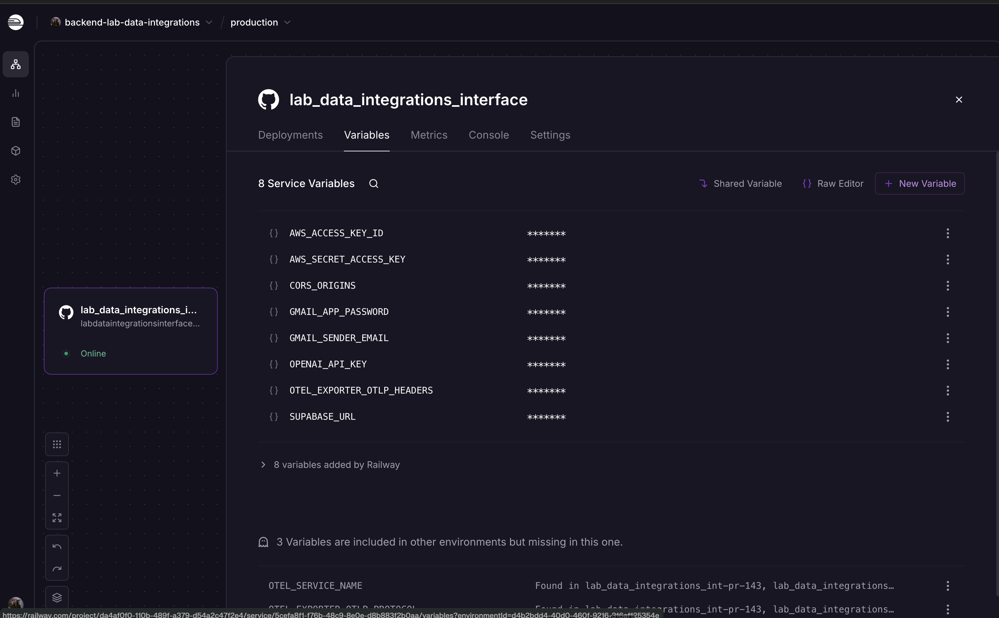

# How to link AWS tools to webapp

While building a webapp, you'll find a need to do things such as store data. For these sorts of problems, linking AWS to the webapp is the best way to do this. The following wiki will assume using Railway (see [the webapp doc](HOW_TO_DEPLOY_A_WEBAPP.md)).

## Setting up AWS on Railway/remote server

Wherever you deploy your webapp (here, we're assuming Railway), you'll need to have credentials so that the code can access AWS.

The most straightforward way to do this is with access keys.

This is different than trying to set up AWS on your local machine. This is just a way to be able to allow AWS to work on a web app that's not on your computer. Don't use this if you're trying to access AWS on your computer or on Quest, follow the steps in [this writeup](../tools/aws/HOW_TO_SETUP_AWS_CREDENTIALS.md) instead.

To get access to the credentials, see [this doc](https://docs.google.com/document/d/154KxS15YdQMQIJTOPYla15St4vdllBhwkAMJXSpwjEI/edit?usp=sharing) (if you don't have access to it, ask Mark to enable it; it contains sensitive passwords so it's set to private by default).

These'll come in the following format:

```markdown
AWS_ACCESS_KEY_ID=AKIA...
AWS_SECRET_ACCESS_KEY=...
```

**IMPORTANT**: do NOT write this down in any public-facing file OR anything added to GitHub. This is a pretty big security breach, and with AI agents now scouring the Internet constantly for exposed API keys, a stray set of AWS keys can be dangerous.

When adding to Railway, you can do the following:

- Log into Railway for your project.
- Click your project
- Go to variables
- Click "+ New Variable"
- Add the new variables
- Re-deploy the application

Here's a screenshot of how that page looks.



## Using S3 from a webapp

Once you've done the setup steps, you can now write code that uses AWS and it'll work in your webapp.

Use the `boto3` package. This'll automatically also pick up the AWS access key and secrety from the environment, so no need for extra steps.

Here's an example code snippet for uploading a JSON file to S3:

```python
import json

import boto3


s3 = boto3.client("s3")


def upload_json():
    data = {
        "hello": "world",
        "count": 123,
    }

    s3.put_object(
        Bucket="test-bucket",
        Key="test-files/test-file-1.json",
        Body=json.dumps(data).encode("utf-8"),
        ContentType="application/json",
    )
```

Read [what is S3](../tools/aws/WHAT_IS_S3.md) to learn more about S3.
